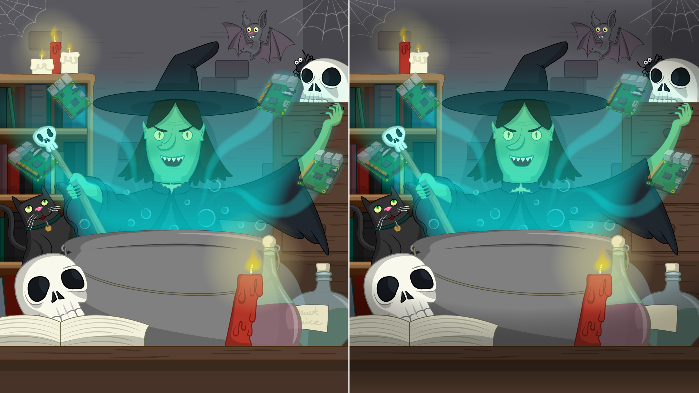

## Introduction

You are going to use Scratch to create a "Spot the difference" game, with a scary surprise, to prank your friends and family.

### What you will make

--- no-print ---

Click on the green flag and then try to click on any differencs you see in the two images. Watch out for the surprise screaming zombie

  <iframe allowtransparency="true" width="485" height="402" src="//scratch.mit.edu/projects/embed/301506768/?autostart=false" frameborder="0" scrolling="no"></iframe>
  

--- /no-print ---

--- print-only ---

--- /print-only ---

--- collapse ---

---
title: What you will need
---

### Hardware

+ A computer capable of running Scratch

### Software

+ Scratch 3 (either [online](http://rpf.io/scratchon){:target="_blank"} or [offline](http://rpf.io/scratchoff){:target="_blank"})

### Downloads

The starter project can be found [here](http://rpf.io/p/en/scary-spot-the-difference-go){:target="_blank"}.

--- /collapse ---

--- collapse ---

---
title: What you will learn
---

+ Recall how to use a loop to detect events
+ Recall how to use the random operator
+ Know how to play an imported sound

--- /collapse ---

--- collapse ---
---
title: Additional information for educators
---

--- no-print ---

If you need to print this project, please use the [printer-friendly version](https://projects.raspberrypi.org/en/projects/scratch-cat-goes-skiing/print){:target="_blank"}.

--- /no-print ---

You can [find the solution for this project here](http://rpf.io/p/en/scratch-cat-goes-skiing-get){:target="_blank"}.

--- /collapse ---
