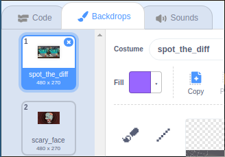
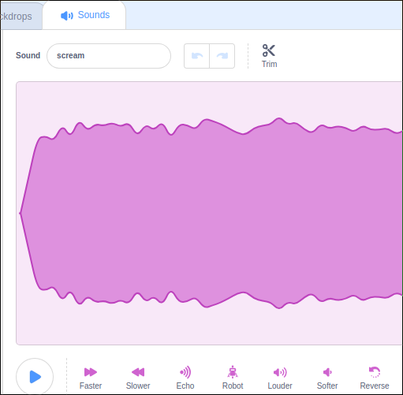

## Get started

--- task ---
Open the Scratch starter project.

**Online**: open the starter project at [rpf.io/scaryspoton](https://rpf.io/scaryspoton){:target="_blank"}.
**Offline**: download the resources at [rpf.io/p/en/scary-spot-the-difference-go](https://rpf.io/p/en/scary-spot-the-difference-go) and open the starter project from the zipped file.

If you need to download and install the Scratch offline editor, download it from [rpf.io/scratchoff](https://rpf.io/scratchoff){:target="_blank"}.

In the starter project, you should see a spot the difference image of a witch.

--- /task ---

--- task ---
Click on the **Backdrops** tab, and you should see another image.

Click on the thumbnail of the zombie, and the zombie image should appear on your stage.
--- /task ---

--- task ---
Next, click on the **Sounds** tab, and you should see a scream sound. Click on the play button to test that you can hear it.

--- /task ---
