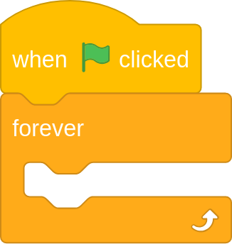
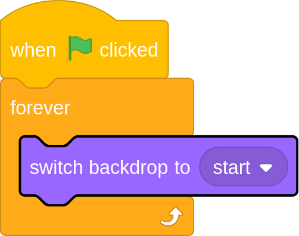

## Detecting mouse clicks

Soon you'll be able to ask a friend to try out your new Spot the difference game. You'll tell them that thye have to click on as many differences as they can find.

What they won't realise is that after their first click, a timer will start and then the Zombie will appear.

--- task ---
To detect mouse events, like a click, your program has to always be listening for the event. You can use a `forever`{:class="blockcontrol"} loop.
Add a `when flag clicked`{:class="blockevents"} block and a `forever`{:class="blockcontrol"} loop to the code for the stage.

--- /task ---

--- task ---
You're going to be changing the backdrop with your code, so to start with you can make sure that the `start`{:class="blocklooks"} backdrop is displayed.]

--- /task ---

--- task ---
Now you need to use an `if`{:class="blockcontrol"} to detect if `mouse down?`{:class="blocksensing"}. If it is then you can `switch backdrop to scare`{:class="blocklooks"}

--- hints --- --- hint ---
You can find the `if`{:class="blockcontrol"} in the **Control** menu and the `mouse down?`{:class="blocksensing"} in the **Looks* menu.
--- /hint --- --- hint ---
Here are the blocks you will need to add to your program.

--- /hint --- --- hint ---
Here is what your script should look like.

--- /hint --- --- /hints ---
--- /task ---

--- task ---
Run your program by clicking on the `green flag`{:class="blockevents"}. When you click on the backdrop, the image of the zombie should briefly appear.
--- /task ---
