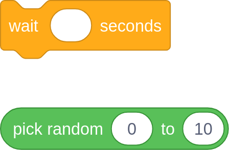
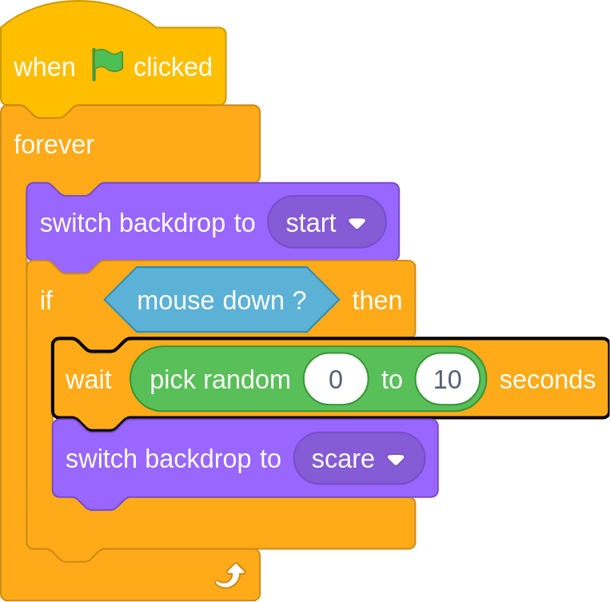

## Random pauses

Your program is nearly finished. In this step you will make the program pause for a random number of seconds, before the zombie appears.

--- task ---
Use a `pick random`{:class="blockoperators"} block and a `wait`{:class="blockcontrol"} block to have your program pause for a few seconds before the image of the zombie appears.

--- hints --- --- hint ---
The `wait`{:class="blockcontrol"} block is in the **Control** menu. Inside this you can place a `pick random`{:class="blockoperators"} block from the **Operators** menu.
--- /hint --- --- hint ---
Here are the two blocks you will need to add to your program.

--- /hint --- --- hint ---
This is what your completed program should look like.

--- /hint --- --- /hints ---
--- /task ---

--- task ---
Test your code by clicking on the `green flag`{:class="blockeventse"}. When you click on the stage, the zombie should appear after a random ammount of time, and then switch back to the spot the difference image.
--- /task ---

