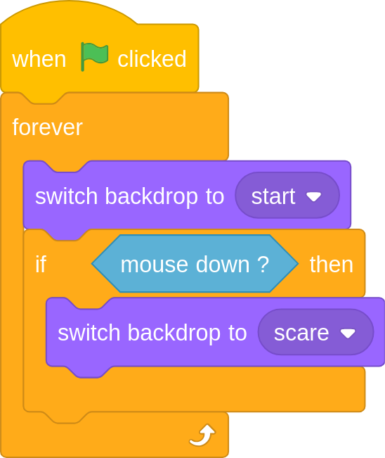
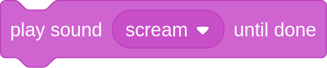

## Add a scream

To finish off, as the zombie image appears, the zombie will scream.

--- task ---
Add a `play sound until done`{:class="blocksound"} block after the zombie image appears, and set it to the *scream* sound.

--- hints --- --- hint ---
You can find the `play sound until done`{:class="blocksound"} block in the **Sounds** menu.
--- /hint --- --- hint ---
Here is the block you will need to add:

--- /hint --- --- hint ---
Here is the completed program

--- /hint --- --- /hints ---
--- /task ---

--- task ---
Test your program by clicking on the `green flag`{:class="blockevents"}. When you click on the stage, after a random time, the zombie should appear and a scream sound play.
--- /task ---

Prank your friends by asking them to play your spot the difference game. Tell them they have to click on all the differences they find in the image, and then watch them jump in fear when the zombie appears.
